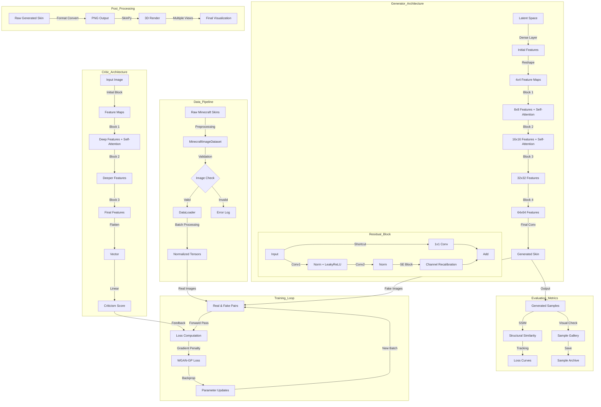

<h2 align='center'>
Minecraft Skin Generator using WGAN-GP
</h2>
A deep learning model that generates unique Minecraft character skins using a Wasserstein GAN with Gradient Penalty (WGAN-GP).

## implementation

<p align="center">Check out Nextjs implementation: https://blockface.vercel.app/</p>

## Sample

<p float="left">
  


</p>

## Overview

This project implements a generative adversarial network to create unique Minecraft character skins. It uses advanced techniques including self-attention mechanisms, adaptive residual blocks, and spectral normalization to produce high-quality, diverse character skins.

## Arcitecture


## Features

- WGAN-GP architecture with gradient penalty for stable training
- Self-attention mechanisms for better global coherence
- Adaptive residual blocks with squeeze-and-excitation
- Spectral normalization for improved training stability
- SSIM (Structural Similarity Index) monitoring during training
- Multi-GPU support for faster training
- Custom dataset handling with image validation


### Environment Setup

It's recommended to use Python 3.11.x with Conda:

```bash
conda create -n minecraft-gan python=3.11
conda activate minecraft-gan

pip install -r requirements.txt
```

## Project Structure

```
minecraft-skin-generator/
├── test/
│   ├── save/
│   │   └── *.png
│   └── *.py
├── model/
│   ├── docs/
│   │   └── *.txt
│   ├── samples/
│   │   ├── model v5/
│   │   │   └── *.png
│   │   └── model v3/
│   │       └── *.png
│   └── *.pth
├── train/
│   └── *.py
├── ipynb_files/
│   └── *.ipynb
├── generated_skins/
│   ├── *.txt
│   └── *.png
└── README.md
```

## Usage

```bash 
# for training
python train/train.py

# for testing
python test/test.py
```

## Files Description

### Training Files (`train/`)
- Main training scripts for the GAN
- Data loading and preprocessing utilities
- Model configuration and hyperparameter settings

### Model Files (`model/`)
- Saved model checkpoints (`.pth`)
- Sample outputs in version-specific directories
- Documentation and model architecture details

### Testing Files (`test/`)
- Scripts for generating and testing skins
- Save directory for test outputs
- Validation utilities

### Jupyter Notebooks (`ipynb_files/`)
- Development and experimentation notebooks
- Training visualization and analysis

### Generated Skins (`generated_skins/`)
- Output directory for generated sample Minecraft skins
- Associated metadata

## Monitoring and Evaluation

The training process includes:
- Generator and Critic loss tracking
- SSIM score monitoring
- Regular sample generation for visual inspection

